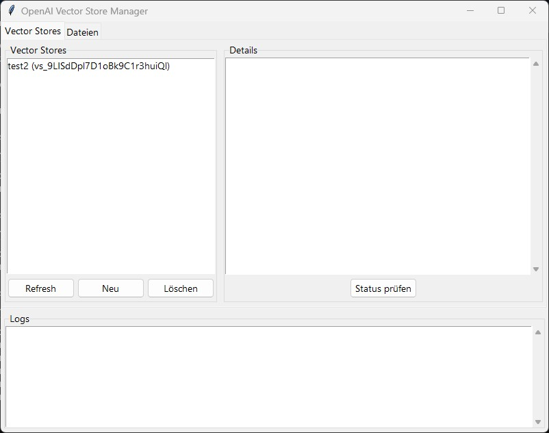

# OpenAI Vector Store Manager
#### Interface in "German" cause i need it in german! If you want you can contribute to this repo



Python interfaces for interacting with OpenAI's Vector Store API - both CLI and GUI versions.

## Features

### Core Module (`gui_less.py`)
- **Vector Store Management**:
  - Create, retrieve, update, and delete vector stores
  - List all available vector stores
  - Automatic status polling until ready
- **File Operations**:
  - Upload files to vector stores
  - List/delete files in stores
  - Supports PDF, TXT, and other OpenAI-supported formats
- **Error Handling**:
  - Comprehensive API error handling
  - Timeout management for long operations

### GUI Version (`gui.py`)
- **Visual Interface**:
  - Tabbed interface for store/file management
  - Real-time status updates
  - Scrollable log panel
- **Interactive Operations**:
  - Store creation/deletion dialogs
  - File upload with native file picker
  - Detailed store metadata viewing
  - Automatic refresh of lists
- **Threaded Operations**:
  - Background processing for API calls
  - Non-blocking UI during operations

## Installation

1. **Prerequisites**:
   - Python 3.7+
   - OpenAI API key

2. **Install packages**:
   ```bash
   pip install requests python-dotenv tkinter
   ```

3. **Environment Setup**:
   - Create `.env` file:
     ```env
     OPENAI_API_KEY=your-api-key-here
     ```

## Usage

### CLI Version (`gui_less.py`)
```python
from gui_less import VectorStoreClient

# Initialize client
client = VectorStoreClient(api_key=os.getenv("OPENAI_API_KEY"))

# Create store
store = client.create_vector_store(name="My Data Store")

# Upload file
client.upload_file(store["id"], "data.pdf")

# Wait for processing
client.poll_until_ready(store["id"])

# List stores
stores = client.list_vector_stores()
```

### GUI Version (`gui.py`)
```bash
python gui.py
```

**GUI Controls**:
1. **Vector Stores Tab**:
   - Left panel: List of all stores
   - Right panel: Detailed store metadata
   - Buttons: Create/Delete/Refresh stores

2. **Files Tab**:
   - File upload controls
   - List of files in selected store
   - Status indicators for files

3. **Log Panel**:
   - Real-time operation logging
   - Error message display

## Examples

### CLI Example Workflow
```python
# Create store
store = client.create_vector_store(name="Research Papers")

# Upload multiple files
for file in ["paper1.pdf", "notes.txt"]:
    client.upload_file(store["id"], file)

# Monitor status
while True:
    status = client.get_vector_store(store["id"])
    print(f"Status: {status['status']}")
    if status["status"] == "completed":
        break
    time.sleep(10)
```

### GUI Workflow
1. Launch application
2. Click "New" to create store
3. Select store from list
4. Choose file and click "Upload"
5. Monitor progress in log panel

## Enhancements Possible

1. **Core Module**:
   - Add pagination support
   - Implement rate limiting
   - Add async operations

2. **GUI Version**:
   - Add progress bars
   - Implement search functionality
   - Add metadata editing
   - Support drag-and-drop uploads

## License

CC4


